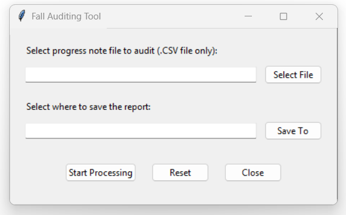

# Local AI Fall Auditing Tool

 **A privacy-first AI nursing assistant that uses on-device LLMs to audit resident progress notes for falls.**

This tool runs entirely offline using [llamafile](https://github.com/Mozilla-Ocho/llamafile) and the `Qwen2.5-7B-Instruct` model. It was built to help aged care nurses and quality teams quickly screen large volumes of progress notes for possible fall incidents — without sending any sensitive data to the cloud.

---

##  Requirements

You’ll need:

- A folder containing:
  - `llamafile-0.9.0.exe`
  - `Qwen2.5-7B-Instruct-Q4_K_M.gguf`
- Python 3.9 or later
- The following are standard Python libraries (no installation needed):
  - `ttk`
  - `csv`
  - `json`
  - `textwrap`
  - `subprocess`

---

##  Screenshot



---
 [Download the latest Windows binary](https://github.com/ZoeDekraker/local-fall-audit-ai/releases)


---

##  How to Run

1. Make sure you have **Python 3.9+** installed.
2. Download or clone this repo.
3. Place the required `.exe` and `.gguf` files in a folder of your choice. (update script with folder name)
4. Run the script:

```
python fall_audit_final_qwen_brain.py
```

5. Use the GUI to:
   - Select a `.csv` file of progress notes  
   - Choose where to save the audit output  
   - Click “Start Processing” and let the local AI do the rest

---

##  Output Format

A `.csv` file will be generated with two columns:

| Progress Note | Falls Detected?         |
|---------------|--------------------------|
| [note text]   | `true`, `false`, or error message |

---

##  Privacy

This app is 100% offline.  
No cloud processing, no internet required — your resident data **never leaves your device**.

---

## ⚠ Legal Disclaimer

By downloading, installing, and using this tool—including running the code and implementing its AI features—you agree that you do so entirely at your own risk.

The developer assumes no responsibility or liability for any inaccuracies, errors, or adverse outcomes that may arise from its use. This tool is provided "as is," without any warranties, express or implied, including (but not limited to) warranties of merchantability or fitness for a particular purpose. Under no circumstances shall the developer be held liable for any direct, indirect, incidental, consequential, or other damages resulting from your use of this tool.

**Please ensure you thoroughly verify all outputs and functionality. Large Language Models can make mistakes.**

---

## 👩‍⚕️ Created By

**Zoe de Kraker**  
Nurse • Coder • AI Cheerleader
